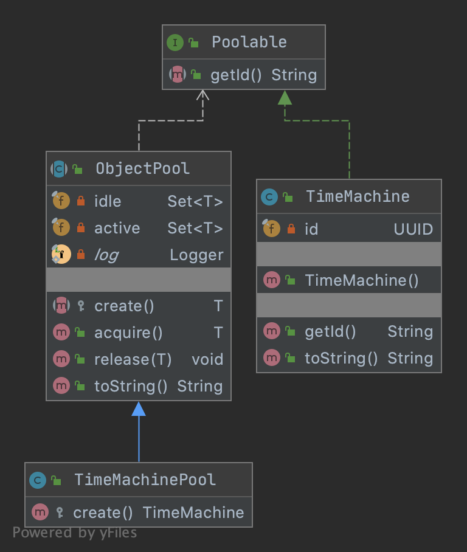

# Object Pool Design Pattern

## Intent
In situations where the initialization cost of a class instance is expensive (allocation cost), the rate of instantiation of a class is high and the instances are needed only for short periods of time (memory fragmentation) it is advantageous to use the Object Pool pattern.

The Object Pool orchestrates the objects creation and provides a cache for objects already instantiated.

## Problem
Imagine in your adventure game you need to use time machines to travel back in time, but the problem is that they are extremely expensive to create.

Instead of creating and disposing every time the time machine instances you can re-use them through a pool.

## Solution

### Structure


The ObjectPool can be enriched adding concept like:
* `poolableTimeout`: controls the maximum number of milliseconds that a client will wait for a poolable from the pool;
* `minimumIdle`: to controls the minimum number of idle poolables to maintain in the pool;
* `maximumPoolSize`: to controls the maximum size that the pool is allowed to reach, including both idle and in-use poolables;
* `idleTimeout`: to control the maximum amount of time that a poolable is allowed to sit idle in the pool);
* `maxLifetime`: controls the maximum lifetime of a poolable in the pool. An in-use poolable will never be retired, only when it is released will it then be removed.

### Code
Here's the `TimeMachine` which is really expensive to create:
```java
public interface Poolable {
    String getId();
}
```

```java
public class TimeMachine implements Poolable {

    private final UUID id;

    public TimeMachine() {
        this.id = UUID.randomUUID();
        try {
            Thread.sleep(3000); // Really expensive :)
        } catch (InterruptedException e) {
            e.printStackTrace();
        }
    }

    @Override
    public String getId() {
        return id.toString();
    }

    @Override
    public String toString() {
        return String.format("TimeMachine id=%s", id);
    }

}
```

Then there is the `ObjectPool` (a generic and re-usable one):

```java
@Slf4j
public abstract class ObjectPool<T extends Poolable> {

    private final Set<T> idle = new HashSet<>();
    private final Set<T> active = new HashSet<>();

    protected abstract T create();

    public synchronized T acquire() {
        long acquiringStart = System.currentTimeMillis();
        if (idle.isEmpty()) {
            idle.add(create());
        }
        T instance = idle.iterator().next();
        idle.remove(instance);
        active.add(instance);
        long acquiringTime = System.currentTimeMillis() - acquiringStart;
        log.debug("Acquired poolable object {} in {}ms", instance.getId(), acquiringTime);
        return instance;
    }

    public synchronized void release(T instance) {
        active.remove(instance);
        idle.add(instance);
        log.debug("Released poolable object " + instance.getId());
    }

    @Override
    public synchronized String toString() {
        return String.format("Pool[idle=%d, active=%d]", idle.size(), active.size());
    }

}
```

The `TimeMachinePool`:

```java
public class TimeMachinePool extends ObjectPool<TimeMachine> {

  @Override
  protected TimeMachine create() {
    return new TimeMachine();
  }
  
}
```

And finally here our adventure game:

```java
@Slf4j
public class App {

    public static void main(String[] args) {
        TimeMachinePool pool = new TimeMachinePool();
        log.info(pool.toString());

        // Acquire 3 time machines
        TimeMachine timeMachine1 = pool.acquire();
        log.info(pool.toString());
        TimeMachine timeMachine2 = pool.acquire();
        log.info(pool.toString());
        TimeMachine timeMachine3 = pool.acquire();
        log.info(pool.toString());
        // Release 2 time machines
        pool.release(timeMachine1);
        log.info(pool.toString());
        pool.release(timeMachine2);
        log.info(pool.toString());
        // Acquire 2 time machines
        TimeMachine timeMachine4 = pool.acquire();
        log.info(pool.toString());
        TimeMachine timeMachine5 = pool.acquire();
        log.info(pool.toString());
        // Release 1 time machine
        pool.release(timeMachine5);
        log.info(pool.toString());
    }

}
```

Looking the game logs there are 2 time machines (`d1febbc9-4c96-4d7a-82f6-7568dd04ce45`, `86654f2d-980c-4bc1-8f01-37a0718fcef4`) that have been acquired in 0ms since the pool already contained idle instances:

```text
19:01:31.647 [main] INFO  com.github.antoniodvr.App - Pool[idle=0, active=0]
19:01:34.662 [main] DEBUG com.github.antoniodvr.ObjectPool - Acquired poolable object 86654f2d-980c-4bc1-8f01-37a0718fcef4 in 3013ms
19:01:34.664 [main] INFO  com.github.antoniodvr.App - Pool[idle=0, active=1]
19:01:37.668 [main] DEBUG com.github.antoniodvr.ObjectPool - Acquired poolable object d1febbc9-4c96-4d7a-82f6-7568dd04ce45 in 3004ms
19:01:37.668 [main] INFO  com.github.antoniodvr.App - Pool[idle=0, active=2]
19:01:40.674 [main] DEBUG com.github.antoniodvr.ObjectPool - Acquired poolable object c69f7a43-72a2-4062-836b-f88b810b77bf in 3006ms
19:01:40.674 [main] INFO  com.github.antoniodvr.App - Pool[idle=0, active=3]
19:01:40.674 [main] DEBUG com.github.antoniodvr.ObjectPool - Released poolable object 86654f2d-980c-4bc1-8f01-37a0718fcef4
19:01:40.675 [main] INFO  com.github.antoniodvr.App - Pool[idle=1, active=2]
19:01:40.675 [main] DEBUG com.github.antoniodvr.ObjectPool - Released poolable object d1febbc9-4c96-4d7a-82f6-7568dd04ce45
19:01:40.675 [main] INFO  com.github.antoniodvr.App - Pool[idle=2, active=1]
19:01:40.676 [main] DEBUG com.github.antoniodvr.ObjectPool - Acquired poolable object d1febbc9-4c96-4d7a-82f6-7568dd04ce45 in 0ms
19:01:40.676 [main] INFO  com.github.antoniodvr.App - Pool[idle=1, active=2]
19:01:40.676 [main] DEBUG com.github.antoniodvr.ObjectPool - Acquired poolable object 86654f2d-980c-4bc1-8f01-37a0718fcef4 in 0ms
19:01:40.676 [main] INFO  com.github.antoniodvr.App - Pool[idle=0, active=3]
19:01:40.676 [main] DEBUG com.github.antoniodvr.ObjectPool - Released poolable object 86654f2d-980c-4bc1-8f01-37a0718fcef4
19:01:40.677 [main] INFO  com.github.antoniodvr.App - Pool[idle=1, active=2]
```